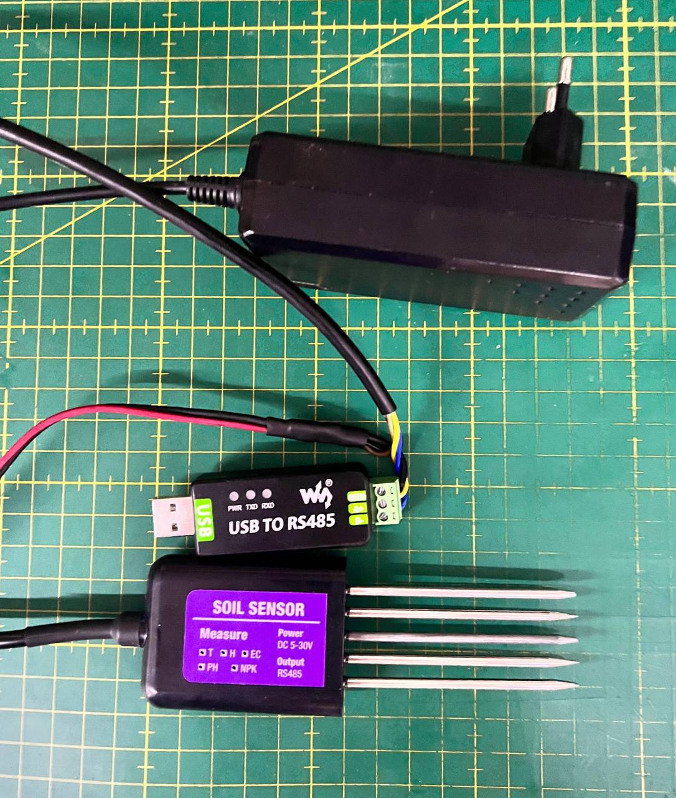

# 🌱 SubSoil: RS485 Soil Sensor Interface


---

## Overview

SubSoil is a Python CLI tool for reading and logging data from cheap 7-in-1 soil sensors (RS485/Modbus) that are all over Aliexpress. I designed it for field use together with a field mapping software that I cannot open source. It supports saving configuration, device connection parameter auto-detection, and reliable data collection from hooked up sensor, scroll down for picture.

---

## Features

- 📦 Simple CLI for setup and reading
- 🔌 Auto-detects sensor configuration (baudrate, address)
- 📈 Reads all key soil parameters: temperature, humidity, EC, pH, NPK
- 📝 Saves and backs up sensor connection details
- 🪵 Rotating, compressed logs
- 🖼️ Device photo and wiring reference

---

## Device & Wiring



*Pictured: 7-in-1 soil sensor (RS485) connected to RS485-to-USB adapter and external power supply.*
  
*Note: many of the readings that cheap sensors such as this one display should not be taken as correct values, rather, one should save them to a time-series DB or such and look at patterns over time, more about this below.*
---

## Installation

1. **Clone the repo:**
   ```zsh
   git clone https://github.com/ndjuric/subsoil.git
   cd subsoil
   ```
2. **Create and activate a virtual environment:**
   ```zsh
   python3 -m venv .venv
   source .venv/bin/activate
   ```
3. **Install dependencies:**
   ```zsh
   pip install -r requirements.txt
   ```
4. **Install as CLI (optional, for `subsoil` command):**
   ```zsh
   pip install -e .
   ```

---

## Usage

Activate your venv, then use the `subsoil` command:

```zsh
source .venv/bin/activate
subsoil --help
```

### Available Commands

- `subsoil setup`  – Interactive setup, auto-detects or lets you enter sensor config. Backs up old config.
- `subsoil read`   – Reads and prints all sensor values using saved config.

---

## Example

```zsh
subsoil setup
# Follow prompts to auto-detect or enter sensor parameters

subsoil read
# Outputs: temperature, humidity, EC, pH, N, P, K
```

---

## Project Structure

- `src/subsoil/` – Main package
- `storage/` – Device config, logs, and backups
- `requirements.txt` – Python dependencies

---

## Appendix: Which metrics are correct, which metrics are approximations?

### Temperature (°C)
- **Expected:** 5–40 °C in soil
- **Test:**
  - Touch with finger → ~30–34 °C
  - Touch cold metal → drops <20 °C
  - Tap water → 10–20 °C
- **Note:** Likely uses NTC thermistor — reliable

### Humidity / Soil Moisture (%)
- **Expected:**
  - Dry soil: <10%
  - Moist soil: 20–35%
  - Mud: >50%
- **Test:**
  - Out of soil → drops to ~2–5%
  - Wet tissue → >15%
- **Reliability:** Good (capacitive)

### EC (Electrical Conductivity, μS/cm)
- **Expected:**
  - Pure water: <50
  - Garden soil: 100–800
  - Fertilized/salty: >1000
- **Test:**
  - Dry soil: ~0
  - Add salt to water → EC >1000
- **Note:** Used for “salinity”/fertility

### pH
- **Expected:**
  - Acidic: 4.5–6.5
  - Neutral: 6.5–7.5
  - Alkaline: >7.5
- **Test:**
  - Lemon juice → drops
  - Baking soda → rises
- **Reliability:** Moderate

### NPK (mg/kg)
> ⚠️ *WARNING*: Values are rough, imprecise — use for trends only (lookup + EC heuristic).

#### Nitrogen (N)
- 0 = lacking
- 1–10 = maybe OK
- 20–30 = fertilized

#### Phosphorus (P)
- <5 = low
- 10–40 = OK
- >50 = fertilized

#### Potassium (K)
- <50 = low
- 100–250 = optimal
- >400 = excessive

#### NPK Reliability
- ✔️ For trends (over time): yes/no
- ❌ For precise values: do not use

---

## License

MIT